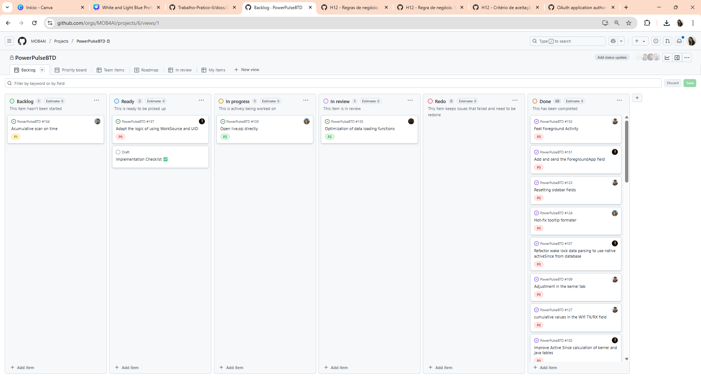
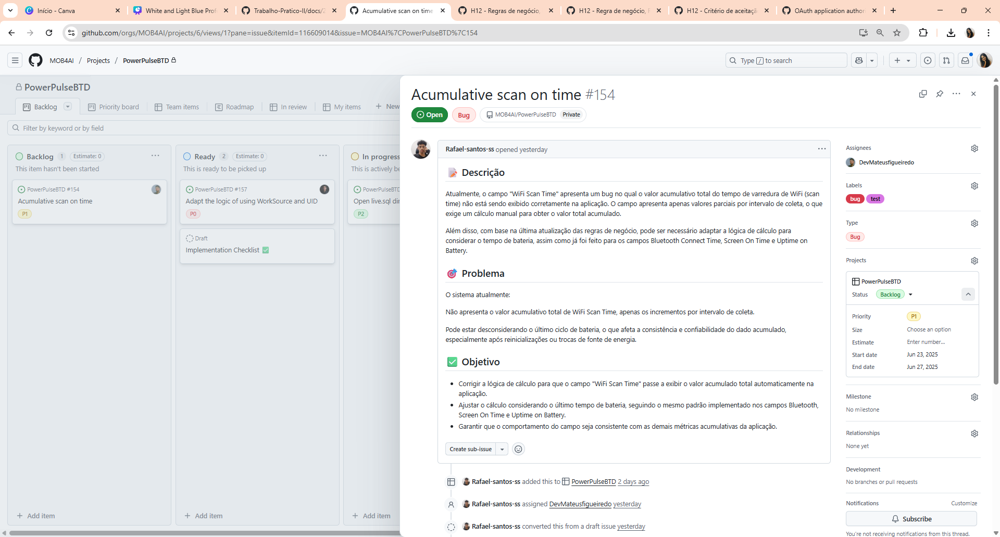
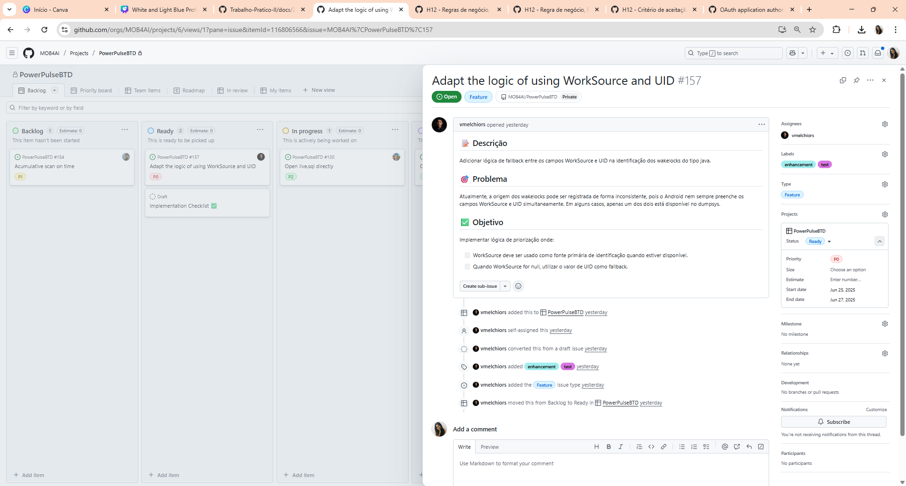
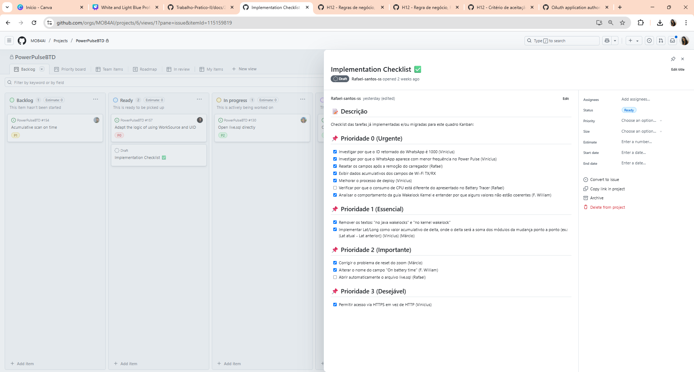
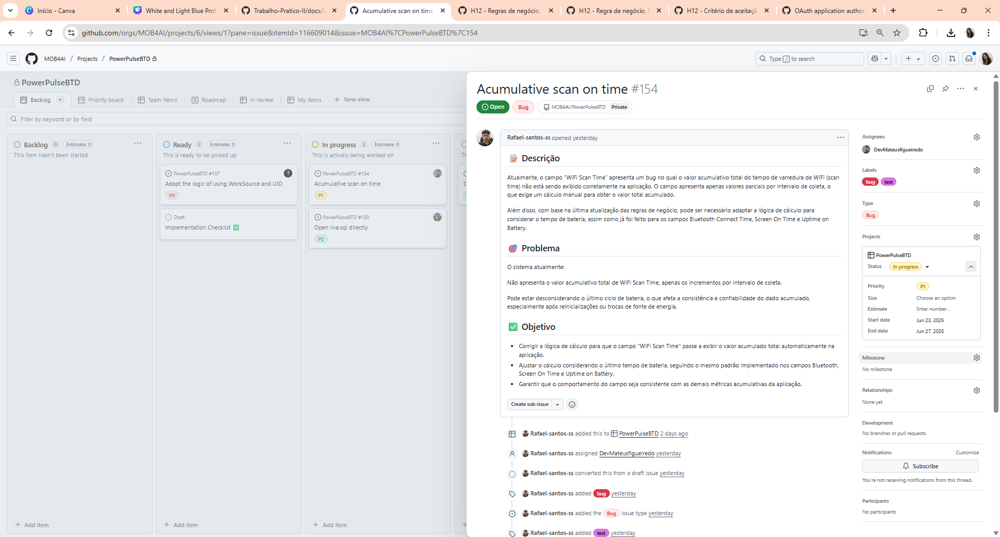
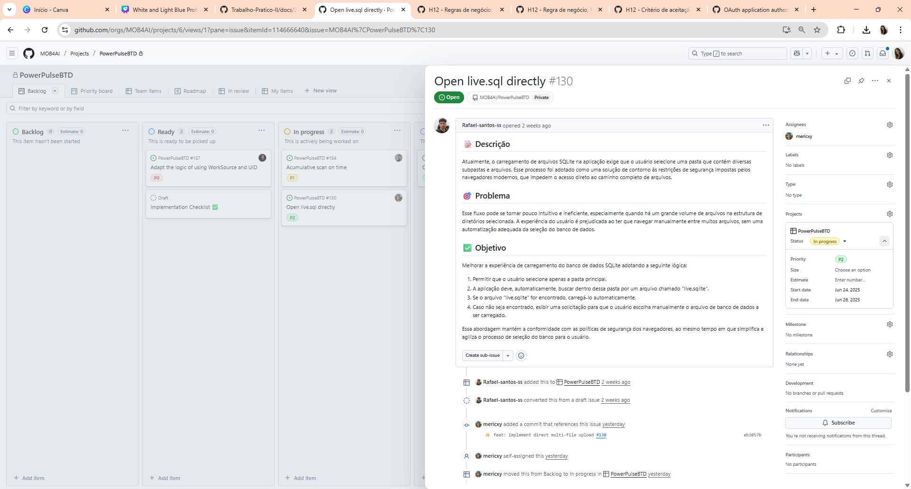
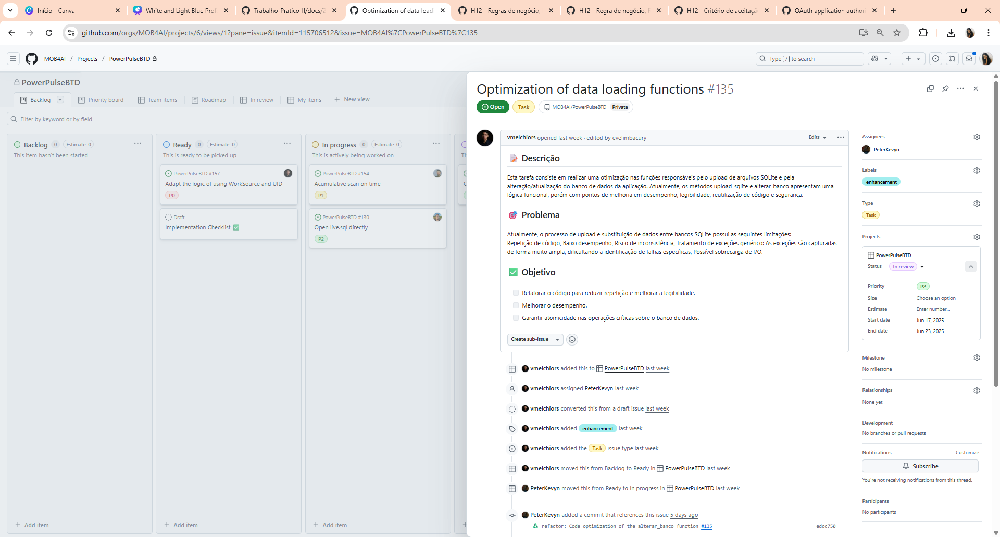
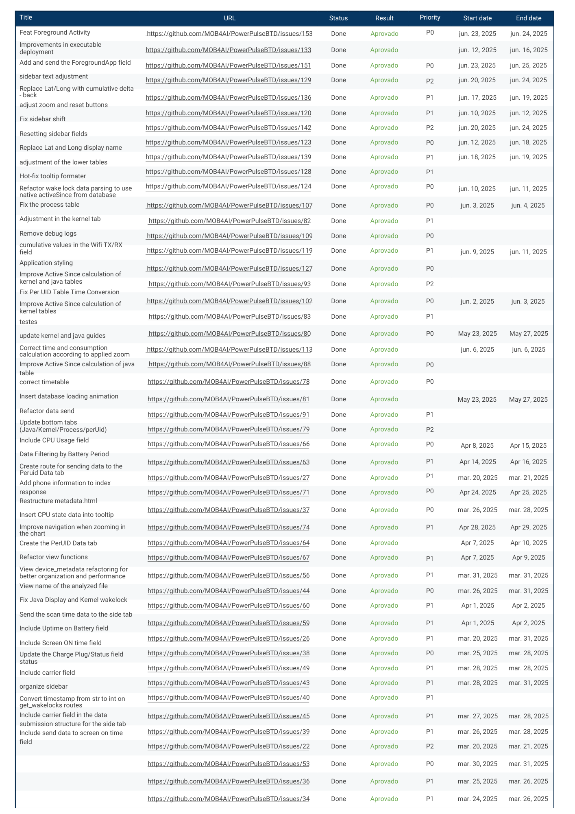
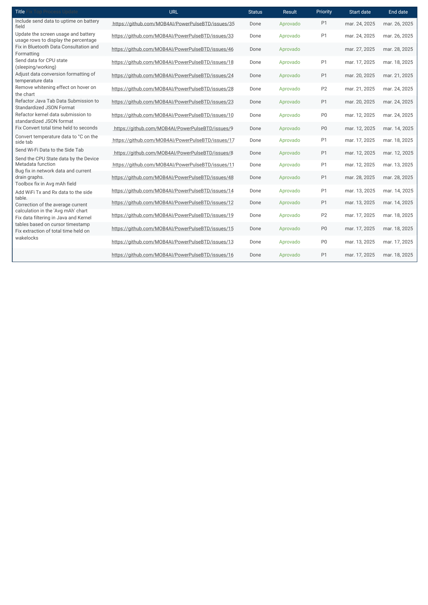

# Relatório de Testes
📄 Relatório de Testes — Março a Junho 2025  Este repositório contém o relatório dos testes realizados. O objetivo é documentar os procedimentos de teste, os resultados obtidos, as ferramentas utilizadas, os problemas encontrados e as soluções aplicadas ao longo do período. 
| N° | Title | URL | Status | Result | Priority | Start date | End date |
|----|-------|-----|--------|--------|----------|------------|----------|
| 1 | Acumulative scan on time | [Link](https://github.com/MOB4AI/PowerPulseBTD/issues/154)| Backlog | Pendente | P1 | jun. 23, 2025 | jun. 27, 2025 |
| 2 | Implementation Checklist ✅ | [Link](https://github.com/orgs/MOB4AI/projects/6?pane=issue&itemId=115159819) | Ready | Pendente | - | - | - |
| 3 | Adapt the logic of using WorkSource and UID | [Link](https://github.com/MOB4AI/PowerPulseBTD/issues/157) | Ready | Pendente | P0 | jun. 25, 2025 | jun. 27, 2025 |
| 4 | Open live.sql directly | [Link](https://github.com/MOB4AI/PowerPulseBTD/issues/130) | In progress | Pendente | P2 | jun. 24, 2025 | jun. 26, 2025 |
| 5 | Optimization of data loading functions | [Link](https://github.com/MOB4AI/PowerPulseBTD/issues/135) | In review | Reprovado | P2 | jun. 17, 2025 | jun. 23, 2025 |
| 6 | Feat Foreground Activity | [Link](https://github.com/MOB4AI/PowerPulseBTD/issues/153) | Done | Aprovado | P0 | jun. 23, 2025 | jun. 24, 2025 |
| 7 | Improvements in executable deployment | [Link](https://github.com/MOB4AI/PowerPulseBTD/issues/133) | Done | Aprovado | - | jun. 12, 2025 | jun. 16, 2025 |
| 8 | Add and send the ForegroundApp field | [Link](https://github.com/MOB4AI/PowerPulseBTD/issues/151) | Done | Aprovado | P0 | jun. 23, 2025 | jun. 25, 2025 |
| 9 | sidebar text adjustment | [Link](https://github.com/MOB4AI/PowerPulseBTD/issues/129) | Done | Aprovado | P2 | jun. 20, 2025 | jun. 24, 2025 |
| 10 | Replace Lat/Long with cumulative delta - back | [Link](https://github.com/MOB4AI/PowerPulseBTD/issues/136) | Done | Aprovado | P1 | jun. 17, 2025 | jun. 19, 2025 |
| 11 | adjust zoom and reset buttons | [Link](https://github.com/MOB4AI/PowerPulseBTD/issues/120) | Done | Aprovado | P1 | jun. 10, 2025 | jun. 12, 2025 |
| 12 | Fix sidebar shift | [Link](https://github.com/MOB4AI/PowerPulseBTD/issues/142) | Done | Aprovado | P2 | jun. 20, 2025 | jun. 24, 2025 |
| 13 | Resetting sidebar fields | [Link](https://github.com/MOB4AI/PowerPulseBTD/issues/123) | Done | Aprovado | P0 | jun. 12, 2025 | jun. 18, 2025 |
| 14 | Replace Lat and Long display name | [Link](https://github.com/MOB4AI/PowerPulseBTD/issues/139) | Done | Aprovado | P1 | jun. 18, 2025 | jun. 19, 2025 |
| 15 | adjustment of the lower tables | [Link](https://github.com/MOB4AI/PowerPulseBTD/issues/128) | Done | Aprovado | P1 | - | - |
| 16 | Hot-fix tooltip formater | [Link](https://github.com/MOB4AI/PowerPulseBTD/issues/124) | Done | Aprovado | P0 | jun. 10, 2025 | jun. 11, 2025 |
| 17 | Refactor wake lock data parsing to use native activeSince from database | [Link](https://github.com/MOB4AI/PowerPulseBTD/issues/107) | Done | Aprovado | P0 | jun. 3, 2025 | jun. 4, 2025 |
| 18 | Fix the process table | [Link](https://github.com/MOB4AI/PowerPulseBTD/issues/82) | Done | Aprovado | P1 | - | - |
| 19 | Adjustment in the kernel tab | [Link](https://github.com/MOB4AI/PowerPulseBTD/issues/109) | Done | Aprovado | P0 | - | - |
| 20 | Remove debug logs | [Link](https://github.com/MOB4AI/PowerPulseBTD/issues/119) | Done | Aprovado | P1 | jun. 9, 2025 | jun. 11, 2025 |
| 21 | cumulative values ​​in the Wifi TX/RX field | [Link](https://github.com/MOB4AI/PowerPulseBTD/issues/127) | Done | Aprovado | P0 | - | - |
| 22 | Application styling | [Link](https://github.com/MOB4AI/PowerPulseBTD/issues/93) | Done | Aprovado | P2 | - | - |
| 23 | Improve Active Since calculation of kernel and java tables | [Link](https://github.com/MOB4AI/PowerPulseBTD/issues/102) | Done | Aprovado | P0 | jun. 2, 2025 | jun. 3, 2025 |
| 24 | Fix Per UID Table Time Conversion | [Link](https://github.com/MOB4AI/PowerPulseBTD/issues/83) | Done | Aprovado | P1 | - | - |
| 25 | Improve Active Since calculation of  kernel tables | [Link](https://github.com/MOB4AI/PowerPulseBTD/issues/80) | Done | Aprovado | P0 | May 23, 2025 | May 27, 2025 |
| 26 | testes | [Link](https://github.com/MOB4AI/PowerPulseBTD/issues/113) | Done | Aprovado | - | jun. 6, 2025 | jun. 6, 2025 |
| 27 | update kernel and java guides | [Link](https://github.com/MOB4AI/PowerPulseBTD/issues/88) | Done | Aprovado | P0 | - | - |
| 28 | Correct time and consumption calculation according to applied zoom | [Link](https://github.com/MOB4AI/PowerPulseBTD/issues/78) | Done | Aprovado | P0 | - | - |
| 29 | Improve Active Since calculation of java table | [Link](https://github.com/MOB4AI/PowerPulseBTD/issues/81) | Done | Aprovado | - | May 23, 2025 | May 27, 2025 |
| 30 | correct timetable | [Link](https://github.com/MOB4AI/PowerPulseBTD/issues/91) | Done | Aprovado | P1 | - | - |
| 31 | Insert database loading animation | [Link](https://github.com/MOB4AI/PowerPulseBTD/issues/79) | Done | Aprovado | P2 | - | - |
| 32 | Refactor data send | [Link](https://github.com/MOB4AI/PowerPulseBTD/issues/66) | Done | Aprovado | P0 | Apr 8, 2025 | Apr 15, 2025 |
| 33 | Update bottom tabs(Java/Kernel/Process/perUid) | [Link](https://github.com/MOB4AI/PowerPulseBTD/issues/63) | Done | Aprovado | P1 | Apr 14, 2025 | Apr 16, 2025 |
| 34 | Include CPU Usage field | [Link](https://github.com/MOB4AI/PowerPulseBTD/issues/27) | Done | Aprovado | P1 | mar. 20, 2025 | mar. 21, 2025 |
| 35 | Data Filtering by Battery Period | [Link](https://github.com/MOB4AI/PowerPulseBTD/issues/71) | Done | Aprovado | P0 | Apr 24, 2025 | Apr 25, 2025 |
| 36 | Create route for sending data to the Peruid Data tab | [Link](https://github.com/MOB4AI/PowerPulseBTD/issues/37) | Done | Aprovado | P0 | mar. 26, 2025 | mar. 28, 2025 |
| 37 | Add phone information to index response | [Link](https://github.com/MOB4AI/PowerPulseBTD/issues/74) | Done | Aprovado | P1 | Apr 28, 2025 | Apr 29, 2025 |
| 38 | Restructure metadata.html | [Link](https://github.com/MOB4AI/PowerPulseBTD/issues/64) | Done | Aprovado | - | Apr 7, 2025 | Apr 10, 2025 |
| 39 | Insert CPU state data into tooltip | [Link](https://github.com/MOB4AI/PowerPulseBTD/issues/67) | Done | Aprovado | P1 | Apr 7, 2025 | Apr 9, 2025 |
| 40 | Improve navigation when zooming in the chart | [Link](https://github.com/MOB4AI/PowerPulseBTD/issues/56) | Done | Aprovado | P1 | mar. 31, 2025 | mar. 31, 2025 |
| 41 | Create the PerUID Data tab | [Link](https://github.com/MOB4AI/PowerPulseBTD/issues/44) | Done | Aprovado | P0 | mar. 26, 2025 | mar. 31, 2025 |
| 42 | Refactor view functions | [Link](https://github.com/MOB4AI/PowerPulseBTD/issues/60) | Done | Aprovado | P1 | Apr 1, 2025 | Apr 2, 2025 |
| 43  | View device_metadata refactoring for better organization and performance               | [link](https://github.com/MOB4AI/PowerPulseBTD/issues/59                                      )| Done   | Aprovado | P1       | Apr 1, 2025  | Apr 2, 2025  |
| 44  | View name of the analyzed file                                                          | [link](https://github.com/MOB4AI/PowerPulseBTD/issues/26                                      )| Done   | Aprovado | P1       | Mar 20, 2025 | Mar 31, 2025 |
| 45  | Fix Java Display and Kernel wakelock                                                    | [link](https://github.com/MOB4AI/PowerPulseBTD/issues/38                                      )| Done   | Aprovado | P0       | Mar 25, 2025 | Mar 28, 2025 |
| 46  | Send the scan time data to the side tab                                                 | [link](https://github.com/MOB4AI/PowerPulseBTD/issues/49                                      )| Done   | Aprovado | P1       | Mar 28, 2025 | Mar 28, 2025 |
| 47  | Include Uptime on Battery field                                                         | [link](https://github.com/MOB4AI/PowerPulseBTD/issues/43                                      )| Done   | Aprovado | P1       | Mar 28, 2025 | Mar 31, 2025 |
| 48  | Include Screen ON time field                                                            | [link](https://github.com/MOB4AI/PowerPulseBTD/issues/40                                      )| Done   | Aprovado | P1       |              |              |
| 49  | Update the Charge Plug/Status field status                                              | [link](https://github.com/MOB4AI/PowerPulseBTD/issues/45                                      )| Done   | Aprovado | P1       | Mar 27, 2025 | Mar 28, 2025 |
| 50  | Include carrier field                                                                   | [link](https://github.com/MOB4AI/PowerPulseBTD/issues/39                                      )| Done   | Aprovado | P1       | Mar 26, 2025 | Mar 28, 2025 |
| 51  | Organize sidebar                                                                        | [link](https://github.com/MOB4AI/PowerPulseBTD/issues/22                                      )| Done   | Aprovado | P2       | Mar 20, 2025 | Mar 21, 2025 |
| 52  | Convert timestamp from str to int on get_wakelocks routes                               | [link](https://github.com/MOB4AI/PowerPulseBTD/issues/53                                      )| Done   | Aprovado | P0       | Mar 30, 2025 | Mar 31, 2025 |
| 53  | Include carrier field in the data submission structure for the side tab                 | [link](https://github.com/MOB4AI/PowerPulseBTD/issues/36                                      )| Done   | Aprovado | P1       | Mar 25, 2025 | Mar 26, 2025 |
| 54  | Include send data to screen on time field                                               | [link](https://github.com/MOB4AI/PowerPulseBTD/issues/34                                      )| Done   | Aprovado | P1       | Mar 24, 2025 | Mar 26, 2025 |
| 55  | Fix Top Process Update                                                                  | [link](https://github.com/MOB4AI/PowerPulseBTD/issues/35                                      )| Done   | Aprovado | P1       | Mar 24, 2025 | Mar 26, 2025 |
| 56  | Include send data to uptime on battery field                                            | [link](https://github.com/MOB4AI/PowerPulseBTD/issues/33                                      )| Done   | Aprovado | P1       | Mar 24, 2025 | Mar 26, 2025 |
| 57  | Update the screen usage and battery usage rows to display the percentage                | [link](https://github.com/MOB4AI/PowerPulseBTD/issues/46                                      )| Done   | Aprovado |          | Mar 27, 2025 | Mar 28, 2025 |
| 58  | Fix in Bluetooth Data Consultation and Formatting                                       | [link](https://github.com/MOB4AI/PowerPulseBTD/issues/18                                      )| Done   | Aprovado | P1       | Mar 17, 2025 | Mar 18, 2025 |
| 59  | Send data for CPU state (sleeping/working)                                              | [link](https://github.com/MOB4AI/PowerPulseBTD/issues/24                                      )| Done   | Aprovado | P1       | Mar 20, 2025 | Mar 21, 2025 |
| 60  | Adjust data conversion formatting of temperature data                                   | [link](https://github.com/MOB4AI/PowerPulseBTD/issues/28                                      )| Done   | Aprovado | P2       | Mar 21, 2025 | Mar 24, 2025 |
| 61  | Remove whitening effect on hover on the chart                                           | [link](https://github.com/MOB4AI/PowerPulseBTD/issues/23                                      )| Done   | Aprovado | P1       | Mar 20, 2025 | Mar 24, 2025 |
| 62  | Refactor Java Tab Data Submission to Standardized JSON Format                           | [link](https://github.com/MOB4AI/PowerPulseBTD/issues/10                                      )| Done   | Aprovado | P0       | Mar 12, 2025 | Mar 24, 2025 |
| 63  | Refactor kernel data submission to standardized JSON format                             | [link](https://github.com/MOB4AI/PowerPulseBTD/issues/9                                       )| Done   | Aprovado | P0       | Mar 12, 2025 | Mar 14, 2025 |
| 64  | Fix Convert total time held to seconds                                                  | [link](https://github.com/MOB4AI/PowerPulseBTD/issues/17                                      )| Done   | Aprovado | P1       | Mar 17, 2025 | Mar 18, 2025 |
| 65  | Convert temperature data to °C on the side tab                                          | [link](https://github.com/MOB4AI/PowerPulseBTD/issues/8                                       )| Done   | Aprovado | P1       | Mar 12, 2025 | Mar 12, 2025 |
| 66  | Send Wi-Fi Data to the Side Tab                                                         | [link](https://github.com/MOB4AI/PowerPulseBTD/issues/11                                      )| Done   | Aprovado | P1       | Mar 12, 2025 | Mar 13, 2025 |
| 67  | Send the CPU State data by the Device Metadata function                                 | [link](https://github.com/MOB4AI/PowerPulseBTD/issues/48                                      )| Done   | Aprovado | P1       | Mar 28, 2025 | Mar 28, 2025 |
| 68  | Bug fix in network data and current drain graphs.                                       | [link](https://github.com/MOB4AI/PowerPulseBTD/issues/14                                      )| Done   | Aprovado | P1       | Mar 13, 2025 | Mar 14, 2025 |
| 69  | Toolbox fix in Avg mAh field                                                            | [link](https://github.com/MOB4AI/PowerPulseBTD/issues/12                                      )| Done   | Aprovado | P1       | Mar 13, 2025 | Mar 14, 2025 |
| 70  | Add WiFi Tx and Rx data to the side table.                                              | [link](https://github.com/MOB4AI/PowerPulseBTD/issues/19                                      )| Done   | Aprovado | P2       | Mar 17, 2025 | Mar 18, 2025 |
| 71  | Correction of the average current calculation in the 'Avg mAh' chart                    | [link](https://github.com/MOB4AI/PowerPulseBTD/issues/15                                      )| Done   | Aprovado | P0       | Mar 17, 2025 | Mar 18, 2025 |
| 72  | Fix data filtering in Java and Kernel tables based on cursor timestamp                  | [link](https://github.com/MOB4AI/PowerPulseBTD/issues/13                                      )| Done   | Aprovado | P0       | Mar 13, 2025 | Mar 17, 2025 |
| 73  | Fix extraction of total time held on wakelocks                                          | [link](https://github.com/MOB4AI/PowerPulseBTD/issues/16)| Done   | Aprovado | P1       | Mar 17, 2025 | Mar 18, 2025 |

# Apresentação visual dos Testes
Nesta secção, mostramos como os testes do projeto foram organizados e executados. A ideia é destacar, por meio de prints e registros visuais, cada etapa do processo, evidenciando as funcionalidades testadas, os resultados obtidos e a estrutura adotada para garantir que tudo estivesse funcionando conforme o esperado. A organização dos testes seguiu uma lógica clara de prioridades e entregas, permitindo um acompanhamento eficaz do progresso durante o desenvolvimento.

## Backlog 
Lista de tarefas planejadas, ainda não iniciadas. Reúne tudo o que precisa ser feito futuramente.

## Ready
Tarefas priorizadas e prontas para serem iniciadas. Já têm definição clara do que deve ser feito.

    
    

## In Progress
Tarefas que estão atualmente em desenvolvimento.

    
    

## In Review
Tarefas concluídas, mas que estão passando por revisão

    

## Redo
Tarefas que precisam ser refeitas ou ajustadas após a revisão.No momento estamos com nenhuma. 

    

## Done
Tarefas finalizadas e aprovadas. Já passaram por todos os estágios anteriores.

